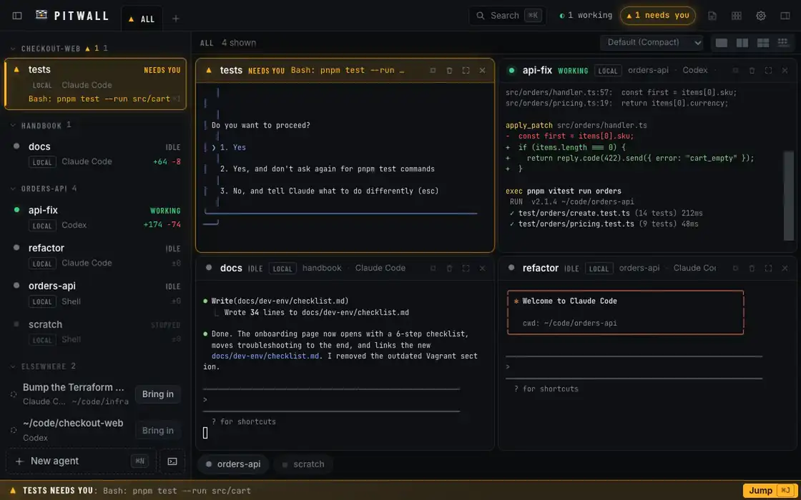

<p align="center">
  
</p>

<h1 align="center">Pitwall</h1>

<p align="center">
  <strong>You call the strategy. Agents drive.</strong><br />
  Run Claude Code, Codex and any other terminal coding agent side by side,<br />
  and see at a glance which one needs you.
</p>

<p align="center">
  <a href="https://github.com/AleksandreJavakhishvili/pitwall/releases/latest"></a>
  <a href="LICENSE"></a>
  <a href="#install"></a>
</p>

<p align="center">
  <a href="https://aleksandrejavakhishvili.github.io/pitwall/">Website</a> ·
  <a href="https://aleksandrejavakhishvili.github.io/pitwall/download/">Download</a> ·
  <a href="https://aleksandrejavakhishvili.github.io/pitwall/docs/quick-start/">Quick start</a> ·
  <a href="https://aleksandrejavakhishvili.github.io/pitwall/docs/how-it-works/">How it works</a> ·
  <a href="CHANGELOG.md">Changelog</a> ·
  <a href="ROADMAP.md">Roadmap</a>
</p>

<p align="center">
  
</p>
<p align="center"><sub>Recorded from the web demo of the UI, with made-up projects. <a href="https://aleksandrejavakhishvili.github.io/pitwall/">Try it live on the website.</a></sub></p>

## Why Pitwall

- **The one that needs you turns amber.** A permission prompt or a question flags the agent, sorts it to the top, lights a bar along the bottom of the window and counts it on the Dock badge (taskbar button on Windows). `⌘J` jumps there.
- **A tool, not an agent.** It never rewrites your prompts or decides what an agent does. Text you send goes in exactly as written.
- **Your agents outlive the app.** `⌘Q` closes the window, not the agents: their terminals keep running and come back with the scrollback.
- **The real CLIs, unwrapped.** Agents launch through your login shell with your PATH, logins and config. Hooks are used when an agent offers them and are never required.
- **Native and light.** A Rust app drawn on the GPU with [GPUI](https://www.gpui.rs), Zed's UI framework. No web view: terminals are parsed and drawn in the same process, so it can stay open all day next to a wall of busy agents ([Performance](#performance)).

## Features

| Area | What you get |
|---|---|
| **Status** | Flags for needs you, done, working, idle, exited and stopped. From hooks when the agent offers them (Claude Code per launch, Codex opt-in), else its screen matched against per-agent rules, else output activity. Native notifications when the window isn't focused. |
| **Wall** `⌘E` | Every live terminal at once, grouped by project, the ones that need you first. View-only; click a tile to take over. |
| **Next up** `⌘.` | Queue the next instruction while the agent works. It's sent when the agent is done or idle and you aren't typing in it. |
| **Review** `⌘R` | What each agent changed, per task. Comment on lines and send them back as one prompt; commit and merge only when you click. |
| **Files** `⌘P` `⇧⌘F` | A read-only explorer of the agent's folder: file tree, viewer, quick open and search. The Changes panel matches `git status` and shows the branch. |
| **Spaces and tiles** | From one pane up to 4×4, spaces in their own windows, density settings for big walls. |
| **Appearance** | Light or dark, Flat or Glass: native Liquid Glass on macOS 26, vibrancy on older macOS, Mica on Windows 11, a painted "Glass lite" elsewhere. Terminals stay opaque; Reduce transparency and Reduce motion are respected. |
| **Terminals** `⌘T` | A plain terminal in the focused agent's folder. Start `claude` or `codex` in it and the pane becomes that agent; Restart resumes it. |
| **Rules** | One rule library, written into CLAUDE.md, AGENTS.md and friends through [rulesync](https://github.com/dyoshikawa/rulesync), per project or per agent. Generated files stay out of your diffs. |
| **Worktrees** | Through the agent's own flag (`claude --worktree`, `codex --worktree`). Pitwall creates no branches or folders of its own. |
| **First launch** | A read-only scan: agent CLIs on your PATH, recent projects and conversations you can continue. Nothing changes until you tick a box. |
| **agw machines and CLI** | Sessions on agw VMs next to your local agents, and a `pitwall` CLI for you or an agent; anything that changes another machine waits for your approval. |
| **Race Engineer** (optional) | An assistant agent for Pitwall itself, one click from the top bar or ⌘K: set up agw, arrange spaces, start agents per project, tune settings by asking. It runs on the agent you pick (Claude Code, Codex, Gemini CLI, …, on your own subscription) and works through the `pitwall` CLI; risky steps still wait for your OK. Nothing runs until you open it. |

### Supported agents

| Agent | Command | Status from | Resume |
|---|---|---|---|
| Claude Code | `claude` | hooks + screen | yes |
| Codex | `codex` | hooks (opt-in) + screen | yes |
| Gemini CLI | `gemini` | screen | yes |
| opencode | `opencode` | screen | yes |
| Cursor Agent | `cursor-agent` | screen | yes |
| GitHub Copilot CLI | `copilot` | screen | yes |
| Qwen Code | `qwen` | screen | yes |
| Amp | `amp` | screen | yes |
| Aider | `aider` | screen | no |
| any other CLI / shell | `$SHELL` | output activity | no |

Agents launch through your login shell (`$SHELL -l -i -c`; PowerShell on Windows), so they see the same PATH, logins and config as in your terminal. A new agent is one TOML file: definitions live in [`crates/pitwall-core/agents/`](crates/pitwall-core/agents/) and detection rules in [`crates/pitwall-detect/detect/`](crates/pitwall-detect/detect/); put your own in `~/.pitwall/agents/` and `~/.pitwall/detect/` (Linux: `~/.local/share/pitwall/…`; Windows: `%APPDATA%\Pitwall\…`).

<details>
<summary><strong>Terminals that survive restarts</strong></summary>

Each agent's terminal is owned by its own small `pitwall-hold` process, not by the app. `⌘Q` closes the UI only: dev servers and half-finished turns keep running, and the next launch re-attaches with the scrollback replayed. Only Stop, Restart, Remove or **Quit and Stop Agents** (app menu on macOS, File menu or tray on Windows, command palette everywhere) end a terminal. After a reboot, agents come back stopped and Restart resumes the conversation for CLIs that support it.

```
Pitwall.app      UI, quit any time
   │  attach · write · resize · replay      ~/.pitwall/run/hold/<agent>.sock
   ▼
pitwall-hold     one per agent, setsid, owns the PTY
   ▼
claude --session-id …   still running
```

</details>

<details>
<summary><strong>agw machines</strong></summary>

If you run agents on VMs with `agw`, its sessions sit next to your local agents, grouped by machine.

- **Works today:** add an existing session and get its live terminal, its status (screen detection), Next up, stop and start; diffs and Review run git on the VM through agw; New agent → *Runs on* creates a session on a VM using agw's own workspaces, users and templates.
- **Not yet:** hooks and rules on VMs, merging from Review, and deleting a session on the VM. Removing an agw agent from Pitwall only detaches it.

</details>

<details>
<summary><strong>The <code>pitwall</code> CLI and approvals</strong></summary>

Settings → *Install command-line tool* links `pitwall` into `~/.local/bin` or `/usr/local/bin`. It talks to the running app over a local socket and prints JSON (`--human` for text), so agents can use it too. Inside a Pitwall pane it finds the app on its own.

```bash
pitwall agent list
pitwall agent new --kind claude --project ~/code/api --name api
pitwall session list --provider agw
pitwall session add agw <vm> <session> --start
pitwall machine form <vm>      # what a new session on that VM can be
pitwall settings list          # every setting: value, allowed values, description
pitwall settings set appearance.theme dark
pitwall queue add api "run the tests"      # or --status idle for every idle agent
pitwall space move "API" --to-window new   # spaces, windows, projects, rules
pitwall wait api --for done --fresh        # agents can coordinate each other
pitwall agent stop api                     # stop, restart, remove: you approve in Pitwall
```

The CLI does what the UI does: agents (new, stop, restart, remove, rename, status), queued prompts, spaces and windows, projects, rules, read-only review (`review changes`) and settings, plus `wait`. Stopping, restarting or removing an agent asks for your approval when anyone but you asks. Settings are also plain JSON: `~/.pitwall/ui.json` (schema: [`docs/settings.schema.json`](docs/settings.schema.json)) applies live when edited, and a value that isn't allowed is reported and the last good one kept. Settings that change something outside Pitwall (installing Codex hooks or the CLI link) ask for your approval when an agent changes them. Anything that changes another machine (starting or creating a session on a VM) opens an approval dialog in Pitwall and the command waits for your answer; a denial exits with status 3. Pitwall identifies the caller from the connecting process, so an agent can't approve its own request. There's an agent skill for it in [`skills/pitwall/SKILL.md`](skills/pitwall/SKILL.md).

</details>

## Install

Download from the [latest release](https://github.com/AleksandreJavakhishvili/pitwall/releases/latest), or use the [download page](https://aleksandrejavakhishvili.github.io/pitwall/download/), which picks your system. Builds aren't code-signed yet, so the first launch takes one extra click on macOS and Windows.

| Platform | Download | First launch |
|---|---|---|
| macOS (Apple silicon, Intel) | `Pitwall_<version>_universal.dmg` (or `.app.tar.gz`) | Right-click Pitwall.app → **Open** → **Open**, or System Settings → Privacy & Security → **Open Anyway**. |
| Windows 10 1809+ / 11, x64 | `Pitwall_<version>_x64-setup.exe` (recommended, per user) or `.msi` | SmartScreen: **More info → Run anyway**. Preview: less tested than macOS. |
| Linux x86_64 (glibc 2.35+, e.g. Ubuntu 22.04, Debian 12, Fedora 36) | `Pitwall_<version>_amd64.AppImage` or `.deb` | `chmod +x` the AppImage, or `sudo apt install ./Pitwall_*_amd64.deb`. |

Every release has one `SHA256SUMS.txt` covering all downloads. Shortcuts in this README are written for macOS; on Linux and Windows read ⌘ as Ctrl+Shift and ⌘⇧ as Ctrl+Shift+Alt (plain Ctrl stays with the terminal). Terminals copy and paste with Ctrl+Shift+C / Ctrl+Shift+V there. On Linux there's no native menu: Settings is Ctrl+Shift+, and Quit is in the command palette; on Windows there's a File menu, closing the window keeps Pitwall in the tray and the taskbar shows a badge.

<details>
<summary><strong>macOS: first launch, quarantine and folder access</strong></summary>

1. Get the `.dmg` from the [latest release](https://github.com/AleksandreJavakhishvili/pitwall/releases/latest) and drag Pitwall to Applications.
2. Open it the first time with right-click → **Open**, then **Open** in the dialog (or System Settings → Privacy & Security → **Open Anyway** after a blocked launch).

Releases aren't signed with an Apple Developer ID or notarized yet, so Gatekeeper blocks a plain double-click on first launch. If macOS says the app "is damaged", clear the quarantine flag instead:

```bash
xattr -dr com.apple.quarantine /Applications/Pitwall.app
```

Reading projects in Desktop or Documents makes macOS ask for folder access; the welcome screen offers Full Disk Access instead. Until releases are Developer ID signed, macOS sees each new version as a different app and may ask again for folder access (Desktop, Documents) after an update. Each release has a `SHA256SUMS.txt` next to the downloads.

</details>

<details>
<summary><strong>Linux: AppImage or .deb, and where things live</strong></summary>

Get the `.AppImage` or the `.deb` from the [latest release](https://github.com/AleksandreJavakhishvili/pitwall/releases/latest).

```bash
# Debian, Ubuntu and derivatives: installs Pitwall and the libraries it needs
sudo apt install ./Pitwall_*_amd64.deb

# Any distribution: the AppImage (needs FUSE 2: `libfuse2`, or `libfuse2t64` on Ubuntu 24.04)
chmod +x Pitwall_*_amd64.AppImage
./Pitwall_*_amd64.AppImage
```

The `.deb` puts the app in `/usr/bin/pitwall` with its helpers (`pitwall-hold`, `pitwall-cli`) next to it and adds a desktop entry. The AppImage copies its helpers to `~/.local/share/pitwall/bin/` on start, because agents' terminal holders keep running after the app (and the AppImage's mount) is gone.

Where things live on Linux:

- Pitwall's own data: `$XDG_DATA_HOME/pitwall` (default `~/.local/share/pitwall`) instead of macOS's `~/.pitwall`. `PITWALL_HOME` overrides both.
- Onboarding reads VS Code's and Cursor's recent folders from `$XDG_CONFIG_HOME` (default `~/.config/Code`, `~/.config/Cursor`), Claude Code and Codex from `~/.claude` and `~/.codex` as on macOS.
- Hooks (Claude Code, Codex) reach Pitwall through `curl`: the `.deb` depends on it; with the AppImage install it yourself if your distribution lacks it (without it, status comes from the screen instead).
- Agents start through your login shell (`$SHELL -l -i`), so your PATH from `.bashrc` / `.zshrc` applies even when Pitwall is started from the desktop.
- Closing the main window quits the app; agents keep running in their holders and are back when you open Pitwall again. They end when you log out, or with **Quit and stop all agents** in the command palette.
- Pitwall draws with Vulkan, so it needs a working Vulkan driver (Mesa's, on most distributions, or your GPU vendor's).

Settings → **Install command-line tool** links `pitwall` into `~/.local/bin`. On a `.deb` install `/usr/bin/pitwall` is the app itself, so keep `~/.local/bin` before `/usr/bin` on your PATH (the default on most distributions) for `pitwall` to be the CLI.

</details>

<details>
<summary><strong>Windows (preview): SmartScreen, PowerShell and the tray</strong></summary>

Get the installer (`Pitwall_<version>_x64-setup.exe`, per user, no admin rights) or the `.msi` from the [latest release](https://github.com/AleksandreJavakhishvili/pitwall/releases/latest). Windows 10 1809 or newer (Pitwall's terminals use ConPTY).

Windows is a preview since 0.1.1: CI tests pass, but it has seen little use on real PCs yet; please [report problems](https://github.com/AleksandreJavakhishvili/pitwall/issues). The first builds aren't code-signed, so **SmartScreen** shows "Windows protected your PC" on first run: click **More info → Run anyway**. Check the download against `SHA256SUMS.txt` first (`Get-FileHash .\Pitwall_*_x64-setup.exe`).

Where things live and how it differs from macOS:

- Agents start through PowerShell (`pwsh` if installed, else Windows PowerShell), with PATH as a new terminal would have it, so CLIs installed after Pitwall started are found. Set `PITWALL_SHELL` to use another shell.
- Pitwall's data lives in `%APPDATA%\Pitwall` (`PITWALL_HOME` still overrides it); terminals, hooks and the CLI talk over named pipes only your account can open.
- Closing the window keeps Pitwall in the tray (click it to come back); the number of agents that need you shows on the taskbar button.
- App shortcuts are **Ctrl+Shift**+key (plain Ctrl keys go to the terminal): Ctrl+Shift+K for the command palette, Ctrl+Shift+T for a terminal, and so on.
- "Install command-line tool" puts `pitwall.exe` in `%LOCALAPPDATA%\Pitwall\bin`; add that folder to your PATH.

</details>

<details>
<summary><strong>Homebrew (coming)</strong></summary>

Coming. A cask is ready in [`packaging/homebrew/pitwall.rb`](packaging/homebrew/pitwall.rb) and will be published as `brew install --cask aleksandrejavakhishvili/tap/pitwall` once the tap exists.

</details>

<details>
<summary><strong>Build from source</strong></summary>

You need Rust (`rustup`; the toolchain is pinned in `rust-toolchain.toml` and installed automatically), plus at least one agent CLI you're logged in to. Pitwall is a Cargo workspace; `scripts/package-app.sh` builds the app and its helpers (`pitwall-hold`, the `pitwall` CLI and, on Windows, the `pitwall-hook` relay) in release mode and bundles them into `target/package/`.

```bash
git clone https://github.com/AleksandreJavakhishvili/pitwall.git
cd pitwall
scripts/package-app.sh                     # macOS: Pitwall.app + .dmg · Linux: AppImage + .deb · Windows: .exe + .msi
scripts/package-app.sh --formats app       # only some formats
```

- **macOS:** Xcode. Release builds precompile GPUI's Metal shaders, which needs Xcode's Metal toolchain (`xcodebuild -downloadComponent MetalToolchain` on Xcode 26); without it, `scripts/package-app.sh --runtime-shaders` makes a bundle that compiles them on first launch.
- **Linux:** `cargo install cargo-packager --locked --version 0.11.8`, and GPUI's libraries (Debian/Ubuntu names):

  ```bash
  sudo apt install build-essential curl wget file pkg-config patchelf libfuse2 \
    clang libxkbcommon-dev libxkbcommon-x11-dev libwayland-dev libx11-dev libx11-xcb-dev libxcb1-dev \
    libfontconfig-dev libfreetype-dev libvulkan1 libvulkan-dev libzstd-dev libasound2-dev libglib2.0-dev libssl-dev
  ```
- **Windows:** the MSVC build tools and the Windows SDK, `cargo-packager` as above, and Git Bash to run the script.

On macOS, then either run the `.app` from `target/package/` in place or copy it to `/Applications`. A build you made yourself isn't quarantined, so it opens without the right-click step, but macOS will re-ask for folder access after every rebuild because each build has a different signature.

To avoid that, sign your builds with a local certificate: `scripts/install-local.sh` quits Pitwall (agents keep running), copies the build to `/Applications`, signs it and its helpers with an identity called **Pitwall Local Signing**, and reopens it. Privacy grants then survive rebuilds. Create the identity once:

1. Keychain Access → Certificate Assistant → **Create a Certificate…**
2. Name: `Pitwall Local Signing`, Identity Type: **Self Signed Root**, Certificate Type: **Code Signing**. Create.
3. Check: `security find-identity -p codesigning` lists it.

```bash
scripts/install-local.sh target/package/Pitwall.app
PITWALL_SIGN_IDENTITY="My Identity" scripts/install-local.sh path/to/Pitwall.app
```

</details>

## Quick start

1. **Open Pitwall.** The first launch is a read-only scan: agent CLIs on your PATH, recent projects and conversations you can continue. Tick what you want and press **Start**.
2. **Start an agent** with `⌘N`: pick a project, a kind and a name. Tick *Separate worktree* to use the agent's own `--worktree` flag (Claude Code and Codex).
3. **Watch the flags.** `⌘J` jumps to the next agent that needs you, `⌘E` opens the Wall, `⌘K` the command palette.
4. **Queue follow-ups** in Next up (`⌘.`, then `⌘↵`); with Auto-send on they go in when the agent is done or idle.
5. **Review** with `⌘R`: comment on lines, send them back as one prompt, commit and merge when you're happy.
6. **Quit any time.** `⌘Q` closes the UI only; **Quit and Stop Agents** ends everything.

The [quick start on the website](https://aleksandrejavakhishvili.github.io/pitwall/docs/quick-start/) has every shortcut and where Pitwall keeps its files.

## Performance

<!-- Keep every performance number in this table only. -->
Since v0.2, Pitwall is a native app: the same engine, with the UI drawn on the GPU by GPUI in the same process instead of in a web view.

| Pitwall's own processes (never the agents) | v0.2 (native) ¹ | v0.1 (web view) ² |
|---|---|---|
| 15 busy agents (Claude/Codex-like TUIs redrawing ~10×/s), 4 on screen ³ | ~11 % of one core, ~330 MB | ~65 % of one core, ~620 MB |
| Idle window, no agents | ~0 % CPU, ~70–75 MB | ~0.2 % CPU, ~100 MB |
| Scrolling | 120 fps | not measured |
| Web view processes | none | WebContent + a GPU process that keeps ~220 MB once a terminal paints |
| Window material (Glass) | Liquid Glass on macOS 26, Mica on Windows 11 | none (Flat only) |

<sub>¹ Release builds of the native app. ² Release build, from [`docs/spec/perf.md`](docs/spec/perf.md). ³ The same simulated load on both, `scripts/bench.py --agent tui`. All on an M-series Mac.</sub>

Carried over from v0.1: terminals are parsed in Rust (`alacritty_terminal`), and git for local agents refreshes on file-system events instead of polling, which cut the git processes for 20 working agents to a third.

## Roadmap

[ROADMAP.md](ROADMAP.md) (also [on the website](https://aleksandrejavakhishvili.github.io/pitwall/roadmap/)) says what's being worked on now, what's next and what comes later: signed builds, Windows out of preview, agents that keep running while the app is closed, and plain SSH machines.

## Contributing

Issues and pull requests are welcome. [CONTRIBUTING.md](CONTRIBUTING.md) covers building and testing, the commit convention (Conventional Commits, checked by a `commit-msg` hook and in CI) and what a pull request needs. [CHANGELOG.md](CHANGELOG.md) is generated from the commits with git-cliff.

<details>
<summary><strong>Development</strong></summary>

```bash
cargo run -p pitwall-app      # the app (debug build)
cargo test --workspace        # Rust: app, terminal view, core, detection, holder, providers, CLI
cargo clippy --workspace --all-targets -- -D warnings
pnpm install && pnpm dev      # the web demo of the UI, in a browser, with mock agents
pnpm test                     # tests for the web demo (vitest)
```

The code is a Cargo workspace: `crates/pitwall-app` is the app (GPUI), `crates/pitwall-term-view` its terminal view over `alacritty_terminal`, `crates/pitwall-core` the engine, `crates/pitwall-detect` the screen rules, `crates/pitwall-hold` the terminal holder, `crates/pitwall-providers` where agents run (this computer, agw), and `crates/pitwall-{proto,client,daemon,cli}` the socket protocol and CLI. `src/` is the React build of the UI used for the website's web demo. Start with [`docs/spec/architecture.md`](docs/spec/architecture.md); the rest of the specs are indexed in [`docs/CONTRACT.md`](docs/CONTRACT.md) and the plan is in [`docs/spec/roadmap.md`](docs/spec/roadmap.md).

</details>

<details>
<summary><strong>Website</strong></summary>

The site in [`website/`](website/) is plain HTML + Vite and embeds the web demo of the UI (the React build against mock agents). `cd website && pnpm install --ignore-workspace && pnpm build --base /pitwall/` builds both (see [`website/README.md`](website/README.md)).

It deploys to GitHub Pages from `.github/workflows/pages.yml` on every push to `main`. To turn that on once: **Settings → Pages → Build and deployment → Source: GitHub Actions**.

</details>

<details>
<summary><strong>CI and releases</strong></summary>

- `.github/workflows/ci.yml`: `cargo test` and `cargo clippy` for the whole workspace on macOS, Linux and Windows, the web demo's build and tests, and the website build; on pull requests, the commit messages and the PR title (see [CONTRIBUTING.md](CONTRIBUTING.md#commit-messages)).
- `.github/workflows/release.yml`: push a tag like `v0.2.0` to build a universal `.dmg` and `.app.tar.gz`, a Linux x86_64 `.AppImage` and `.deb`, and the Windows x64 installers (NSIS `-setup.exe`, `.msi`), and publish them as a GitHub Release with one `SHA256SUMS.txt` and the tag's section of `CHANGELOG.md` as the release notes (written by `scripts/release.sh` before tagging). Builds are unsigned (ad-hoc on macOS) unless the signing secrets listed at the top of the workflow are set: then macOS builds are Developer ID signed and notarized, and Windows builds Authenticode signed.

</details>

## Credits

- Agent detection rules, parts of the rule model and approaches in the Windows platform layer are adapted from [Herdr](https://github.com/herdrdev/herdr) (Apache-2.0). Details in [NOTICE](NOTICE).
- File and folder icons from [Material Icon Theme](https://github.com/material-extensions/vscode-material-icon-theme) (MIT).
- Fonts: Inter, JetBrains Mono and Barlow Condensed (SIL Open Font License 1.1), bundled through `@fontsource`. Licence texts are in [LICENSES/](LICENSES).

Pitwall is not affiliated with Formula 1 or with any agent vendor named here.

## License

Pitwall is licensed under the [Apache License 2.0](LICENSE).
