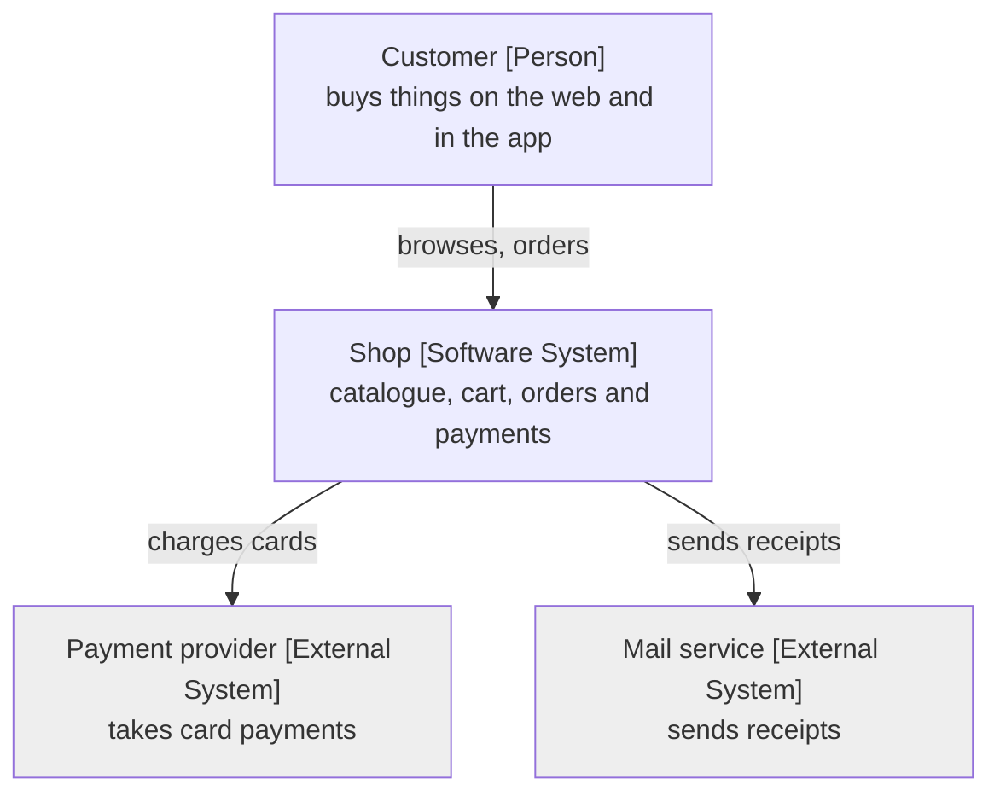
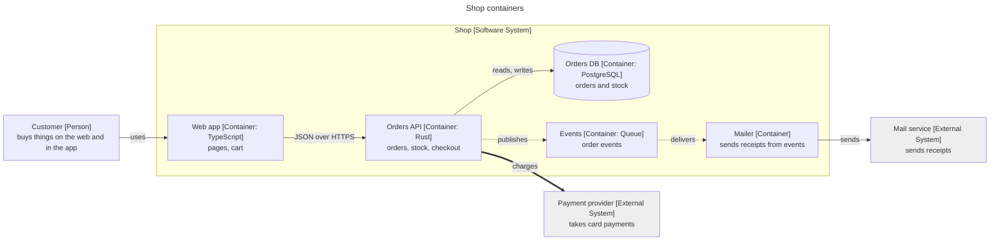

# Shop: architecture

The online shop as an agent following the SDD skill's C4 convention would
draw it.

## System context

```mermaid
flowchart TB
  customer["Customer [Person]<br/>buys things on the web and in the app"]
  shop["Shop [Software System]<br/>catalogue, cart, orders and payments"]
  psp["Payment provider [External System]<br/>takes card payments"]
  mail["Mail service [External System]<br/>sends receipts"]
  customer -->|browses, orders| shop
  shop -->|charges cards| psp
  shop -- sends receipts --> mail
  classDef external fill:#eee
  class psp,mail external
```

## Containers

```mermaid
---
title: Shop containers
---
flowchart LR
  customer["Customer [Person]<br/>buys things on the web and in the app"]
  subgraph shop["Shop [Software System]"]
    web["Web app [Container: TypeScript]<br/>pages, cart"]
    api["Orders API [Container: Rust]<br/>orders, stock, checkout"]
    db[("Orders DB [Container: PostgreSQL]<br/>orders and stock")]
    queue["Events [Container: Queue]<br/>order events"]
    worker["Mailer [Container]<br/>sends receipts from events"]
  end
  psp["Payment provider [External System]<br/>takes card payments"]
  mail["Mail service [External System]<br/>sends receipts"]
  customer -->|uses| web
  web -->|JSON over HTTPS| api
  api -->|reads, writes| db
  api -.->|publishes| queue
  queue -.->|delivers| worker
  worker -->|sends| mail
  api ==>|charges| psp
  classDef external fill:#eee
  class psp,mail external
```
