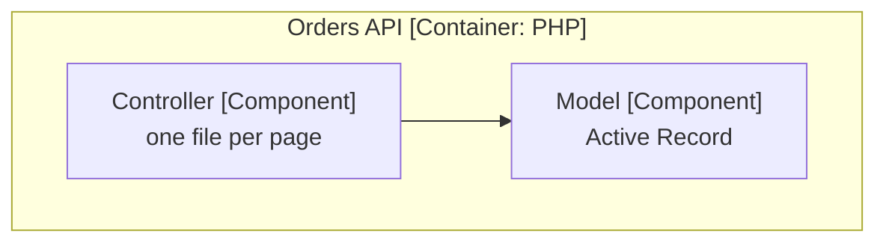

# Legacy orders

The old orders service, kept until the migration ends.

```mermaid
graph TD
  subgraph legacy["Orders API [Container: PHP]"]
    ctl["Controller [Component]<br/>one file per page"]
    model["Model [Component]<br/>Active Record"]
  end
  ctl --> model
```
