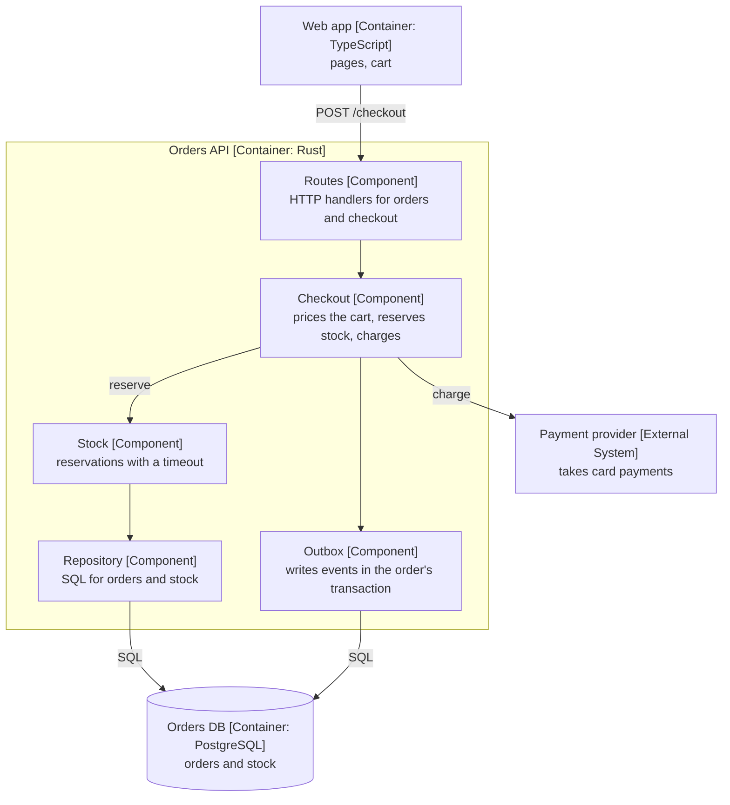
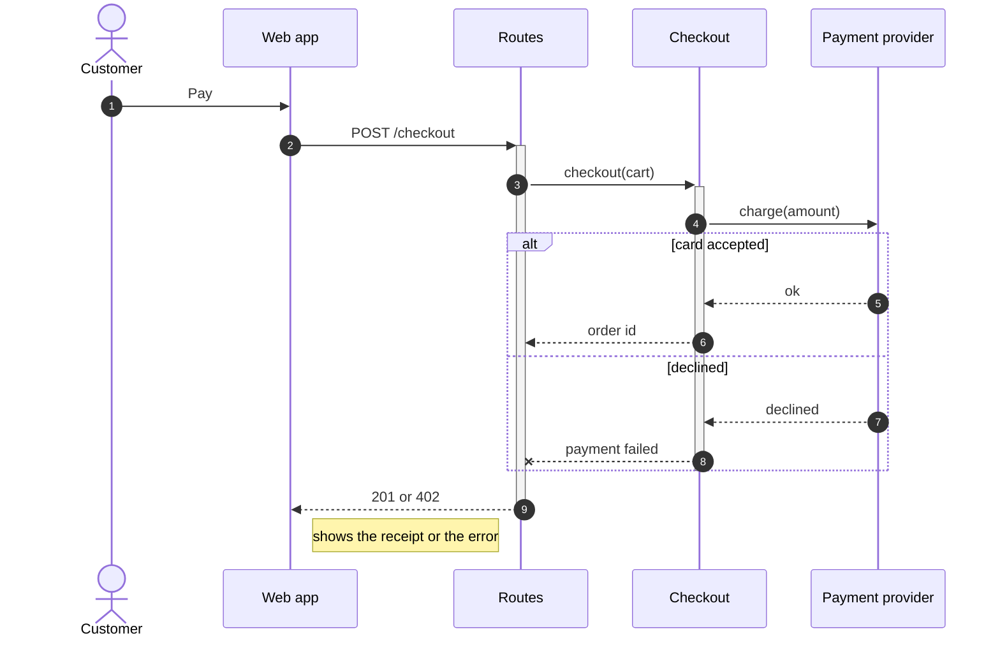

# Orders API: high-level architecture

## Components

```mermaid
flowchart TB
  web["Web app [Container: TypeScript]<br/>pages, cart"]
  subgraph api["Orders API [Container: Rust]"]
    routes["Routes [Component]<br/>HTTP handlers for orders and checkout"]
    checkout["Checkout [Component]<br/>prices the cart, reserves stock, charges"]
    stock["Stock [Component]<br/>reservations with a timeout"]
    repo["Repository [Component]<br/>SQL for orders and stock"]
    outbox["Outbox [Component]<br/>writes events in the order's transaction"]
  end
  db[("Orders DB [Container: PostgreSQL]<br/>orders and stock")]
  psp["Payment provider [External System]<br/>takes card payments"]
  web -->|POST /checkout| routes
  routes --> checkout
  checkout -->|reserve| stock
  checkout -->|charge| psp
  stock --> repo
  checkout --> outbox
  repo & outbox -->|SQL| db
  class psp external
```

## Checkout flow

```mermaid
sequenceDiagram
  autonumber
  actor customer as Customer
  participant web as Web app
  participant routes as Routes
  participant checkout as Checkout
  participant psp as Payment provider
  customer->>web: Pay
  web->>+routes: POST /checkout
  routes->>+checkout: checkout(cart)
  checkout->>psp: charge(amount)
  alt card accepted
    psp-->>checkout: ok
    checkout-->>routes: order id
  else declined
    psp-->>checkout: declined
    checkout--xroutes: payment failed
  end
  deactivate checkout
  routes-->>-web: 201 or 402
  Note right of web: shows the receipt or the error
```
